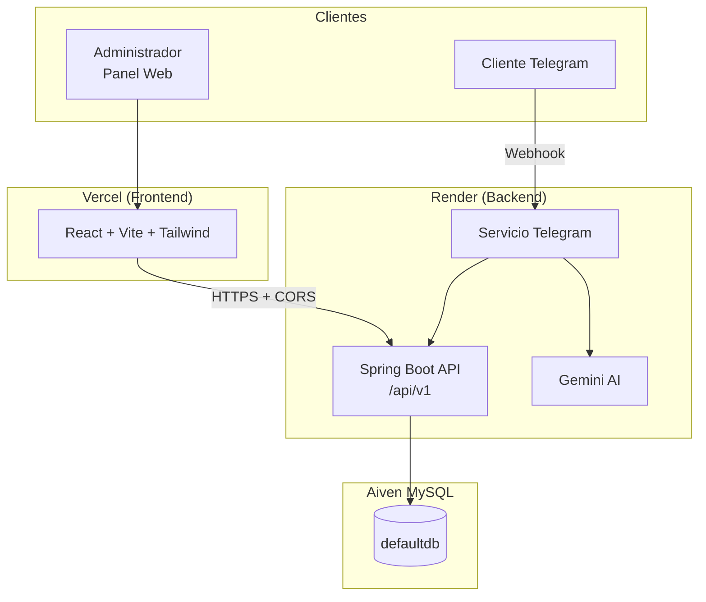
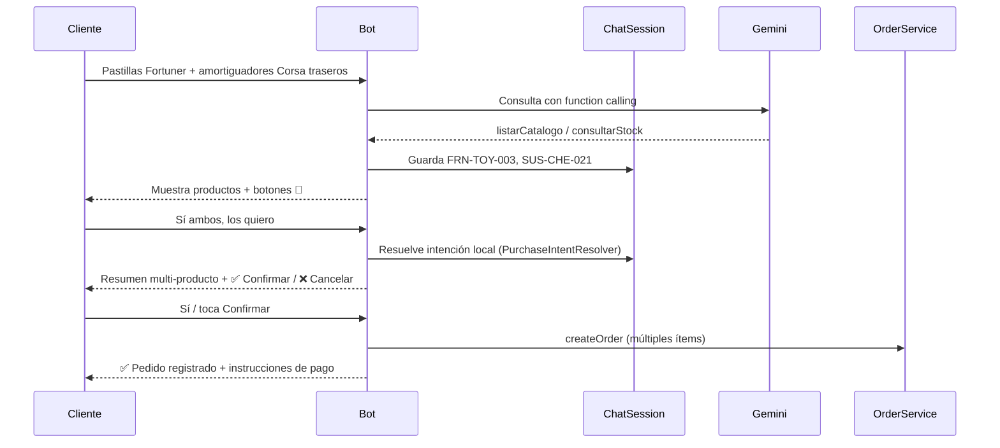
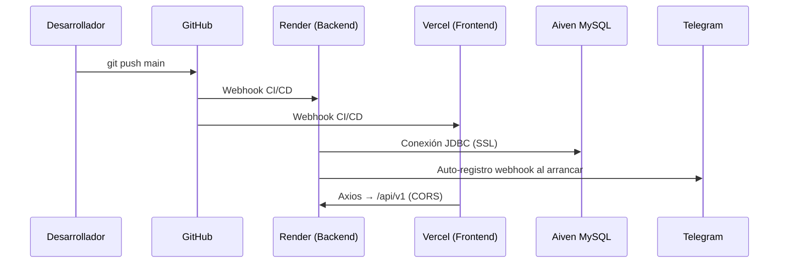

# E-Commerce Micro-SaaS & Panel POS


> Plataforma de **e-commerce / POS** orientada a pequeños comercios. Permite administrar inventario, variantes de producto, stock y órdenes desde un panel web, mientras los clientes finales consultan el catálogo y realizan pedidos a través de un **Bot de Telegram** integrado con **Google Gemini** para respuestas conversacionales.

---

## Tabla de contenidos

- [Descripción general](#descripción-general)
- [Arquitectura del sistema](#arquitectura-del-sistema)
- [Bot de Telegram — flujo conversacional](#bot-de-telegram--flujo-conversacional)
- [Stack tecnológico](#stack-tecnológico)
- [Modelo de datos](#modelo-de-datos)
- [Variables de entorno](#variables-de-entorno)
- [API REST](#api-rest)
- [Instalación y ejecución local](#instalación-y-ejecución-local)
- [Despliegue en producción](#despliegue-en-producción)
- [Estructura del repositorio](#estructura-del-repositorio)
- [Documentación adicional](#documentación-adicional)

---

## Descripción general

Este proyecto es un **Micro-SaaS de comercio electrónico** diseñado para negocios locales (por ejemplo, repuestos automotrices) que necesitan:

| Actor | Canal | Capacidades |
|-------|-------|-------------|
| **Administrador** | Panel web (React) | Consultar inventario, filtrar por categoría, ajustar stock de variantes, gestionar estados de órdenes |
| **Cliente final** | Bot de Telegram | Explorar catálogo, armar carrito y generar pedidos de forma conversacional |
| **Pasarela de pagos** | Webhook simulado | Confirmar pagos y actualizar el estado de las órdenes |

El backend expone una **API REST versionada** bajo `/api/v1`, persiste el dominio en **MySQL 8** y se despliega como contenedor Docker en **Render**. El frontend es una SPA servida por **Vercel** que consume la API con **Axios**, con tolerancia extendida al *cold start* del plan gratuito de Render.

---

## Arquitectura del sistema



### Capas del backend

```
Controller  →  Service  →  Repository  →  MySQL
     ↑              ↑
   DTOs         @Transactional
```

- **Controllers:** exponen endpoints REST; nunca devuelven entidades JPA directamente.
- **Services:** lógica de negocio, control transaccional de stock y órdenes.
- **Repositories:** acceso a datos con Spring Data JPA.
- **GlobalExceptionHandler:** respuestas de error uniformes (`ErrorResponseDTO`).

---

## Bot de Telegram — flujo conversacional

El bot actúa como **asesor comercial virtual** para repuestos automotrices. Combina comandos estructurados, detección local de intención y **Google Gemini** con *function calling* para consultar stock, listar catálogo y registrar pedidos.

### Capacidades

| Canal | Qué puede hacer el cliente |
|-------|---------------------------|
| Comandos | `/start`, `/help`, `/catalogo`, `/comprar SKU [CANTIDAD]` |
| Lenguaje natural | Buscar repuestos por vehículo, consultar precios/stock, confirmar compras sin escribir SKUs |
| Botones inline | 🛒 Comprar, selector de cantidad, confirmar/cancelar pedido |

### Memoria de sesión (`ChatSessionService`)

Cada chat de Telegram mantiene contexto en memoria (~45 min):

- **Productos mostrados:** SKUs vistos recientemente (catálogo o respuestas de Gemini).
- **Pedido pendiente:** ítems inferidos esperando confirmación del cliente.

Esto permite que frases como *"sí, ambos que me mostraste"* o *"los compro"* se resuelvan **sin pedir códigos SKU**.

### Flujo de compra en lenguaje natural



### Detección de intención (`PurchaseIntentResolver`)

Antes de llamar a Gemini, el bot interpreta mensajes comunes:

| Intención | Ejemplos | Acción |
|-----------|----------|--------|
| Compra contextual | *"ambos"*, *"los 2"*, *"los que me mostraste"*, *"los compro"* | Arma pedido con productos mostrados (1 ud. c/u por defecto) |
| Confirmación | *"sí"*, *"dale"*, *"confirmo"* | Registra el pedido pendiente |
| Cancelación | *"no"*, *"cancelar"* | Limpia el pedido pendiente |
| Catálogo | *"catálogo"*, *"qué vendes"* | Muestra inventario sin Gemini |
| Saludo | *"hola"*, *"buenas"* | Menú de bienvenida |

> **Nota:** *"los 2"* con dos productos mostrados significa **ambos productos**, no cantidad 2.

### Herramientas Gemini (function calling)

| Función | Descripción |
|---------|-------------|
| `listarCatalogo()` | Catálogo con stock disponible |
| `consultarStock(sku)` | Precio, stock y compatibilidad por SKU |
| `prepararPedido(items[])` | Valida un pedido multi-ítem y lo deja listo para confirmar |
| `confirmarPedido(items[])` | Crea la orden cuando el cliente acepta |
| `crearOrden(sku, cantidad)` | Orden de un solo ítem (flujo legacy) |

Gemini recibe **contexto de sesión** (productos mostrados y pedido pendiente) para no volver a pedir SKUs cuando el cliente ya vio las opciones.

### Ejemplo de conversación

```
Cliente: véndeme pastillas para la Fortuner y amortiguadores traseros del Corsa, 1 juego cada uno
Bot:     [muestra FRN-TOY-003 y SUS-CHE-021 con precios y stock]

Cliente: sí ambos que me mostraste, quiero los 2, los compraré
Bot:     🛒 Resumen de tu Pedido
         • Pastillas de Freno Cerámicas — FRN-TOY-003 x1 — $145.000
         • Amortiguadores a Gas — SUS-CHE-021 x1 — $180.000
         Total: $325.000
         [✅ Confirmar Pedido] [❌ Cancelar]

Cliente: sí
Bot:     ✅ ¡Pedido Registrado con Éxito! Orden #150 — Total: $325.000
```

Si el cliente necesita ajustar algo (*"solo las pastillas"*, *"cambia a 2 juegos"*), el bot continúa la conversación con el contexto cargado.

### Componentes clave

| Archivo | Responsabilidad |
|---------|-----------------|
| `TelegramBotService` | Orquesta comandos, callbacks, flujo contextual y Gemini |
| `ChatSessionService` | Sesión por `chatId`: productos mostrados y pedido pendiente |
| `PurchaseIntentResolver` | Detecta confirmaciones y referencias a productos previos |
| `GeminiService` | Prompt, function calling y contexto conversacional |
| `TelegramClientService` | Envío de mensajes y teclados inline (incl. multi-pedido) |

---

## Stack tecnológico

### Backend

| Tecnología | Versión / Detalle |
|------------|-------------------|
| Java | 17 |
| Spring Boot | 3.3.6 |
| Spring Data JPA | Hibernate + MySQL 8 Dialect |
| Spring Validation | Bean Validation en DTOs |
| Spring Actuator | Health, metrics, Prometheus |
| MySQL | 8.x — Aiven (prod) / Docker (local) |
| Lombok | Reducción de boilerplate |
| Docker | Multi-stage build (JDK 21 → JRE 21 Alpine) |

### Frontend

| Tecnología | Versión / Detalle |
|------------|-------------------|
| React | 19 |
| TypeScript | ~6.0 |
| Vite | 8 |
| Axios | Timeout 60 s (cold start Render) |
| Tailwind CSS | 4 |
| React Router | 7 |

### Infraestructura y servicios externos

| Servicio | Rol |
|----------|-----|
| **Render** | Web Service Docker del backend (`render.yaml`) |
| **Vercel** | Hosting estático del frontend SPA |
| **Aiven** | MySQL administrado en la nube |
| **Telegram Bot API** | Webhooks para mensajes de clientes |
| **Google Gemini** | Modelo `gemini-2.5-flash` para respuestas del bot |

---

## Modelo de datos

Entidades principales (ver `database/schema.sql`):

| Tabla | Descripción |
|-------|-------------|
| `categories` | Categorías de productos (`is_active` para soft delete) |
| `products` | Productos vinculados a una categoría |
| `product_variants` | SKU, talla, color, stock y precio opcional |
| `customers` | Clientes identificados por `telegram_chat_id` |
| `orders` | Órdenes con estados `PENDING`, `CONFIRMED`, `SHIPPED`, `CANCELLED` |
| `order_items` | Líneas de detalle por variante y cantidad |

Los datos de demostración (repuestos automotrices) están en `database/data.sql`: 3 categorías, 3 productos, 7 variantes, 3 clientes y 4 órdenes.

> **Seeder automático:** al arrancar, `DataInitializer` carga datos mínimos solo si la tabla `categories` está vacía. Si ya ejecutaste `data.sql`, el seeder se omite.

---

## Variables de entorno

### Backend

Spring Boot lee la configuración desde `src/main/resources/application.yml`. Las variables se pueden definir en un archivo `.env` local (copiar desde `.env.example`) o en el dashboard de Render.

> **Nota:** este proyecto usa `DB_URL`, `DB_USER` y `DB_PASSWORD` — equivalentes funcionales a `SPRING_DATASOURCE_URL`, `SPRING_DATASOURCE_USERNAME` y `SPRING_DATASOURCE_PASSWORD`.

| Variable | Obligatoria | Descripción | Ejemplo |
|----------|:-----------:|-------------|---------|
| `DB_URL` | ✅ | JDBC URL de MySQL | `jdbc:mysql://host:24709/defaultdb?sslMode=REQUIRED&allowPublicKeyRetrieval=true` |
| `DB_USER` | ✅ | Usuario de la base de datos | `avnadmin` |
| `DB_PASSWORD` | ✅ | Contraseña de la base de datos | `********` |
| `GEMINI_API_KEY` | ⚠️ | Clave API de Google Gemini (bot conversacional) | `AIza...` |
| `TELEGRAM_BOT_TOKEN` | ⚠️ | Token del bot de Telegram | `123456:ABC-DEF...` |
| `TELEGRAM_BOT_USERNAME` | ⚠️ | Username del bot (sin `@`) | `Autorepuestosdemo_bot` |
| `TELEGRAM_WEBHOOK_SECRET_TOKEN` | ⚠️ | Secret para validar webhooks entrantes | Valor aleatorio seguro |
| `APP_BASE_URL` | ⚠️ | URL pública del backend (prioridad 1) | `https://xxxx.ngrok-free.dev` |
| `APP_URL` | — | URL alternativa del backend (prioridad 2) | `https://e-commerce-backend.onrender.com` |
| `RENDER_EXTERNAL_URL` | — | Inyectada automáticamente por Render (prioridad 3) | — |
| `CORS_ALLOWED_ORIGINS` | ✅ | Orígenes permitidos del frontend, separados por coma | `http://localhost:5173,https://tu-app.vercel.app` |
| `PORT` | — | Puerto HTTP (Render lo inyecta en runtime) | `8080` |
| `SERVER_PORT` | — | Fallback de puerto local | `8080` |

**Prioridad de URL pública:** `APP_BASE_URL` → `APP_URL` → `RENDER_EXTERNAL_URL`

Al iniciar en producción, el backend registra automáticamente el webhook de Telegram en:

```
{APP_BASE_URL}/api/v1/telegram/webhook
```

### Frontend

Definir en `frontend/.env` (local) o en **Vercel → Settings → Environment Variables** (producción).

| Variable | Obligatoria | Descripción | Ejemplo |
|----------|:-----------:|-------------|---------|
| `VITE_API_BASE_URL` | ✅ | URL base de la API (incluye `/api/v1`) | `https://e-commerce-backend.onrender.com/api/v1` |
| `VITE_API_URL` | — | Alias legacy; preferir `VITE_API_BASE_URL` | — |

**Ejemplo — desarrollo local (`frontend/.env`):**

```env
VITE_API_BASE_URL=http://localhost:8080/api/v1
```

**Ejemplo — producción (Vercel):**

```env
VITE_API_BASE_URL=https://tu-servicio.onrender.com/api/v1
```

---

## API REST

Base URL: `{HOST}/api/v1`

### Salud y métricas

| Método | Ruta | Descripción |
|--------|------|-------------|
| `GET` | `/actuator/health` | Estado de salud del servicio (usado por Render) |
| `GET` | `/actuator/info` | Información de la aplicación |
| `GET` | `/actuator/metrics` | Métricas Micrometer |
| `GET` | `/actuator/prometheus` | Métricas en formato Prometheus |

---

### Productos y categorías — `/products`

| Método | Ruta | Parámetros | Body | Descripción |
|--------|------|------------|------|-------------|
| `GET` | `/products/categories` | — | — | Lista todas las categorías activas |
| `POST` | `/products/categories` | — | `CategoryCreateDTO` | Crea una categoría |
| `GET` | `/products` | — | — | Lista todos los productos activos |
| `POST` | `/products` | — | `ProductCreateDTO` | Crea un producto |
| `GET` | `/products/{id}` | `id` (path) | — | Obtiene un producto por ID |
| `GET` | `/products/category/{categoryId}` | `categoryId` (path) | — | Productos activos filtrados por categoría |
| `POST` | `/products/variants` | — | `ProductVariantCreateDTO` | Crea una variante de producto |
| `GET` | `/products/{productId}/variants` | `productId` (path) | — | Variantes activas de un producto |
| `PATCH` | `/products/variants/{variantId}/stock` | `variantId` (path), `newStock` (query) | — | Actualiza el stock de una variante |

<details>
<summary><strong>Esquemas de request (Productos)</strong></summary>

**CategoryCreateDTO**
```json
{ "name": "Sistema de Frenos", "description": "Pastillas, discos..." }
```

**ProductCreateDTO**
```json
{ "categoryId": 1, "name": "Pastillas Cerámicas", "description": "...", "basePrice": 85000.00 }
```

**ProductVariantCreateDTO**
```json
{ "productId": 1, "sku": "FRN-CHE-001", "size": "Juego", "color": "Corsa 1.4", "stock": 15, "priceOverride": 85000.00 }
```

</details>

---

### Órdenes — `/orders`

| Método | Ruta | Parámetros | Body | Descripción |
|--------|------|------------|------|-------------|
| `GET` | `/orders` | — | — | Lista todas las órdenes con ítems |
| `POST` | `/orders` | `customerId` (query) | `OrderItemRequestDTO[]` | Crea una orden y descuenta stock |
| `PATCH` | `/orders/{orderId}/status` | `orderId` (path), `status` (query) | — | Actualiza el estado de una orden |

**Estados válidos (`status`):** `PENDING` · `CONFIRMED` · `SHIPPED` · `CANCELLED`

<details>
<summary><strong>Esquemas de request (Órdenes)</strong></summary>

**OrderItemRequestDTO[]**
```json
[
  { "productVariantId": 1, "quantity": 2 },
  { "productVariantId": 4, "quantity": 1 }
]
```

**Ejemplo — crear orden:**
```http
POST /api/v1/orders?customerId=1
Content-Type: application/json

[{"productVariantId": 1, "quantity": 2}]
```

**Ejemplo — cambiar estado:**
```http
PATCH /api/v1/orders/1/status?status=CONFIRMED
```

</details>

---

### Pagos — `/payments`

| Método | Ruta | Parámetros | Body | Descripción |
|--------|------|------------|------|-------------|
| `POST` | `/payments/checkout` | — | `PaymentRequestDTO` | Inicia el flujo de pago de una orden |
| `POST` | `/payments/webhook` | — | `WebhookNotificationDTO` | Webhook de confirmación de pago |

<details>
<summary><strong>Esquemas de request (Pagos)</strong></summary>

**PaymentRequestDTO**
```json
{ "orderId": 1, "paymentMethod": "NEQUI" }
```

**WebhookNotificationDTO**
```json
{ "orderId": 1, "paymentReference": "REF-001", "status": "APPROVED", "transactionId": "TX-123", "paymentMethod": "NEQUI", "amount": 290000.00 }
```

</details>

---

### Telegram — `/telegram`

| Método | Ruta | Headers | Body | Descripción |
|--------|------|---------|------|-------------|
| `POST` | `/telegram/webhook` | `X-Telegram-Bot-Api-Secret-Token` | `TelegramUpdateDTO` | Recibe actualizaciones del Bot API |

> El header `X-Telegram-Bot-Api-Secret-Token` debe coincidir con `TELEGRAM_WEBHOOK_SECRET_TOKEN`. Solicitudes sin token válido reciben `403 Forbidden`.

---

## Instalación y ejecución local

### Requisitos previos

- **Java 17+** y **Maven 3.9+** (o usar `./mvnw` incluido)
- **Node.js 20+** y **npm**
- **Docker Desktop** (opcional, recomendado para MySQL local)
- Cuentas/configuración de **Telegram Bot** y **Gemini** (opcional para probar el bot)

### 1. Clonar el repositorio

```bash
git clone https://github.com/JoelSantiagoMP/e-commerce.git
cd e-commerce
```

### 2. Configurar variables de entorno

```bash
cp .env.example .env
cp frontend/.env.example frontend/.env
```

Edita `.env` con tus credenciales. Para desarrollo local con Docker, las variables de BD ya están preconfiguradas en `docker-compose.yml`.

### 3. Base de datos MySQL

#### Opción A — Docker Compose (recomendada)

Levanta MySQL 8 con esquema y datos de prueba montados automáticamente:

```bash
docker compose up -d db
```

Los scripts `database/schema.sql` y `database/data.sql` se ejecutan en el primer arranque del contenedor.

#### Opción B — MySQL manual / Aiven

1. Ejecuta `database/schema.sql` para crear las tablas.
2. Ejecuta `database/data.sql` para poblar datos de demostración.
3. Configura `DB_URL`, `DB_USER` y `DB_PASSWORD` en `.env`.

```bash
# Ejemplo con cliente mysql (Aiven)
mysql -h YOUR_AIVEN_HOST -P 24709 -u avnadmin -p \
  --ssl-mode=REQUIRED defaultdb < database/schema.sql

mysql -h YOUR_AIVEN_HOST -P 24709 -u avnadmin -p \
  --ssl-mode=REQUIRED defaultdb < database/data.sql
```

### 4. Backend (Spring Boot)

#### Con Docker Compose (backend + DB)

```bash
docker compose up --build
```

#### Sin Docker (solo JVM)

```bash
# Cargar variables desde .env (Linux/macOS)
export $(grep -v '^#' .env | xargs)

./mvnw spring-boot:run
```

El backend estará disponible en **http://localhost:8080**.

Verifica el estado:

```bash
curl http://localhost:8080/actuator/health
```

### 5. Frontend (Vite)

```bash
cd frontend
npm install
npm run dev
```

El panel estará en **http://localhost:5173**.

### 6. Probar la integración

| Verificación | Comando / Acción |
|--------------|------------------|
| API de categorías | `curl http://localhost:8080/api/v1/products/categories` |
| API de productos | `curl http://localhost:8080/api/v1/products` |
| Panel web | Abrir `http://localhost:5173` → pestaña **Inventario** |
| Órdenes | Navegar a **Órdenes** en el sidebar |

### Scripts útiles

```bash
# Backend — compilar sin tests
./mvnw clean package -DskipTests

# Backend — ejecutar tests
./mvnw test

# Frontend — build de producción
cd frontend && npm run build

# Frontend — preview del build
cd frontend && npm run preview
```

---

## Despliegue en producción

### Resumen del flujo



### Backend en Render

1. Conecta el repositorio en [Render Dashboard](https://dashboard.render.com).
2. Render detecta `render.yaml` (Web Service Docker, plan free, región Oregon).
3. Configura las variables de entorno del backend (ver tabla anterior).
4. El health check apunta a `/actuator/health`.
5. Render inyecta `PORT` y `RENDER_EXTERNAL_URL` automáticamente.

**Variables críticas en Render:**

```env
DB_URL=jdbc:mysql://YOUR_AIVEN_HOST:24709/defaultdb?sslMode=REQUIRED&allowPublicKeyRetrieval=true
DB_USER=avnadmin
DB_PASSWORD=********
GEMINI_API_KEY=********
TELEGRAM_BOT_TOKEN=********
TELEGRAM_BOT_USERNAME=Autorepuestosdemo_bot
TELEGRAM_WEBHOOK_SECRET_TOKEN=********
CORS_ALLOWED_ORIGINS=https://tu-app.vercel.app,http://localhost:5173
```

> `APP_BASE_URL` no es necesaria en Render si usas el dominio `.onrender.com` — `RENDER_EXTERNAL_URL` se resuelve automáticamente.

### Frontend en Vercel

1. Importa el repositorio en [Vercel Dashboard](https://vercel.com).
2. Configura el **Root Directory** en `frontend`.
3. Framework Preset: **Vite**.
4. Build Command: `npm run build` · Output Directory: `dist`.
5. Agrega la variable de entorno:

```env
VITE_API_BASE_URL=https://tu-servicio.onrender.com/api/v1
```

El archivo `frontend/vercel.json` incluye rewrites SPA para React Router.

### CORS

El backend habilita CORS en `/api/**` mediante `CorsConfig`. Los orígenes permitidos se leen de `CORS_ALLOWED_ORIGINS` (lista separada por comas). **Debes incluir la URL exacta de tu despliegue en Vercel** (con `https://`, sin barra final).

```yaml
# application.yml
cors:
  allowed-origins: ${CORS_ALLOWED_ORIGINS:http://localhost:5173,http://127.0.0.1:5173}
```

### Cold Start en Render (plan Free)

En el plan gratuito de Render, el servicio entra en suspensión tras inactividad. La primera petición puede tardar **30–60 segundos** en responder.

El frontend mitiga esto con:

| Mecanismo | Valor | Ubicación |
|-----------|-------|-----------|
| Timeout Axios | **60 000 ms** | `frontend/src/api/client.ts` |
| Reintento ante respuesta vacía | 3 intentos × 2.5 s | `frontend/src/components/products/ProductsView.tsx` |
| Indicador de carga | "Sincronizando con el servidor..." | UI de inventario |

> Si la UI muestra datos vacíos tras el cold start, verifica `VITE_API_BASE_URL` y que `CORS_ALLOWED_ORIGINS` incluya tu dominio de Vercel.

### Base de datos en Aiven

1. Crea un servicio **MySQL 8** en [Aiven Console](https://console.aiven.io).
2. Ejecuta `database/schema.sql` y `database/data.sql` una sola vez.
3. Usa la connection string JDBC en `DB_URL` con `sslMode=REQUIRED`.

---

## Estructura del repositorio

```
e-commerce/
├── database/
│   ├── schema.sql              # DDL — creación de tablas
│   └── data.sql                # Datos de prueba (repuestos automotrices)
├── frontend/
│   ├── src/
│   │   ├── api/                # Cliente Axios y funciones de API
│   │   ├── components/         # Vistas, layout, UI compartida
│   │   └── types/              # Tipos TypeScript
│   ├── vercel.json             # Rewrites SPA para Vercel
│   └── package.json
├── src/main/java/com/tienda/
│   ├── config/                 # CORS, métricas, seeder, RestTemplate
│   ├── controller/             # REST controllers
│   ├── dto/                    # Data Transfer Objects
│   ├── entity/                 # Entidades JPA
│   ├── exception/              # Excepciones y @ControllerAdvice
│   ├── gemini/                 # Integración Google Gemini (chat + function calling)
│   ├── repository/             # Spring Data JPA
│   ├── service/                # Lógica de negocio
│   └── telegram/               # Bot, webhook, sesión de chat, deduplicación
│       ├── dto/                # PendingOrderLine, ShownProduct, DTOs Telegram
│       └── service/            # BotService, ChatSession, PurchaseIntentResolver
├── src/main/resources/
│   └── application.yml         # Configuración Spring Boot
├── Dockerfile                  # Build multi-stage para Render
├── docker-compose.yml          # MySQL + backend local
├── render.yaml                 # Blueprint Render
├── ARCHITECTURE.md             # Especificación arquitectónica detallada
└── README.md                   # Este archivo
```

---

## Documentación adicional

- [`ARCHITECTURE.md`](./ARCHITECTURE.md) — Reglas de ingeniería, modelo de dominio y roadmap de fases.
- [`.env.example`](./.env.example) — Plantilla de variables del backend.
- [`frontend/.env.example`](./frontend/.env.example) — Plantilla de variables del frontend.
- [`render.yaml`](./render.yaml) — Especificación del Web Service en Render.

---

<p align="center">
  Desarrollado con ☕ Spring Boot · ⚛️ React · 🐬 MySQL · ☁️ Render & Vercel
</p>
